# Model

Het model staat voor digitale tuintjes welke bij 'Het web is voor iedereen' door studenten worden gemaakt.

## Learning Log

### 1 okt - Proces

Ik heb vandaag mijn button kleuren aangepast zodat deze wel geschikt en toegankelijk zijn. Ik heb ook meer gradients toegevoed zoals bij de header. Ik ben nog niet tevreden met de stijl van mijn website die ik nu heb, maar ik heb er veel moeite mee om te beslissen wat ik precies wil en ga doen. Voorlopig heb ik nog alleen placeholder images op mijn pagina, maar ga deze gauw vervangen door zelfgemaakte tekeningen die passen bij mijn gewenste stijl.

### 30 sept - WCAG Checklist

Vandaag hebben wij de WCAG checklist gedaan samen met een klasgenoot. Ik heb bij de meeste dingen wel ja kunnen invullen maar er is nog ruimte voor verbetering bij het cintrast van de buttons, de volgorde van de focus links, de grootte van de light/dark buttons zijn niet heel toegankelijk op mobile, ik moet lieve rbuttons gebruiken in mijn navigatie (het zijn links die lijken op buttons).
Wat ik nog toe kan voegen: skip links, media videos, animaties, audio.

Wij hebben de tests gedaan met de contrast meter:

En de kleurenblindheid simulator:

Checkout

Waar staat WCAG en A11y voor?
WCAG staat voor Web Content Accessibility Guidelines. Dit is de standaard voor toegankelijkheid van websites die wordt gebruikt door verschillende bedrijven organisaties enz.

A11y staat voor accessibility. de 11 staat voor de aantal letters tussen de a en y. Dit gaat dus ook om toegankelijkheid voor bijvoorbeeld mensen met een beperking. Hier kan je de checklist gebruiken om jouw website toegankelijker te maken.

Wat vind je lastiger, je laptop/websites alleen met een toetsenbord bedienen of met een screenreader? Waarom? Waar moet je nog mee oefenen?
Ik vind het lastiger om het met een screen reader te bedienen. De screenreader leest wel individuele link, buttons, en heel soms kopteksten maar geen paragraphs.
Ik moet verder kijken als dit ligt aan mijn html of als ik iets verkeerds doe bij mijn screenreader.

Met welke beperking rekening houden vind je het meest lastig?
Het lastigs vind ik waarschijnlijk met visuele beperking, doordat mijn screenreader het nu niet doet. Als die het wel normaal deed denk ik niet dat ik verder nog een andere zou kiezen.

Vind je dat je beperkt wordt in wat je kunt ontwerpen?
Of heb je al manieren gevonden om vanuit een solide basis - die voor iedereen toegankelijk is - allemaal leuke en mooie extra's toe te voegen als je bezoekers dat goed vinden?
Ik vind niet dat ik heel veel beperkt word. Er zijn manieren om eromheen te werken en iets uit te proberen dat werkt voor iedereen.

### 29 sept - Proces

Ik heb vandaag thuis eindelijk de dark and light mode Deep dive gedaan en mijn website aangepast. Ik heb nu bij dark mode een donkerblauwe achtergrond en lichtblauwe tekst, en bij light mode het omgekeerde. Ook is er daarbij een auto button die aan de hand van jouw apparaat instellingen dark of light mode kiest.

Het ziet er nu dus zo uit. Ik ben bewust ervan dat mijn gewenste stijl helemaal niet erin voorkomt en ik deze nog moet toevoegen.
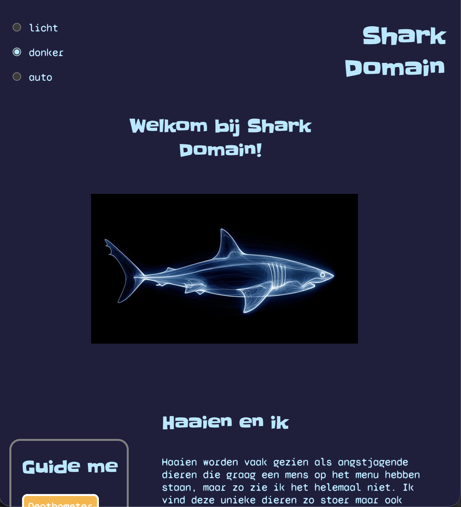
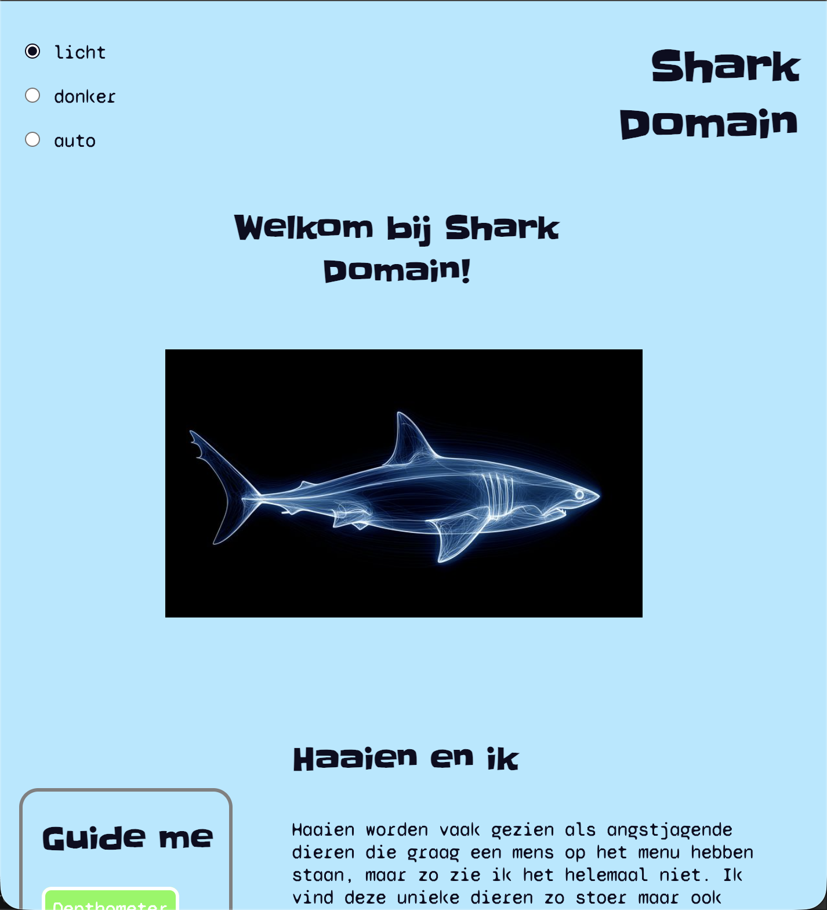

Ik heb de inhoud van mijn website een heel klein beetje aangepast zodat mijn onderwerp meer te maken heeft met mij in plaats van gewoon een saaie informatie pagina is. Ik vind het zelf nog saai maar heb problemen met ideeen bedenken om deze interessanter te maken.

Ik heb nu ook een dialog toegevoegd. Dit is een pop up venster dat komt wanneer je op een button klikt. Ik heb het gemaakt zodat je niet op de achtergrond kan scrollen terwijl dit venster open is. De buttons "accepteer" en "weiger" cookies heeft nog geen echte functie.

### 28 sept - Bi-weekly geek 2

Vandaag hebben wij geleerd hoe wij met een screenreader moeten omgaan en hoe belangrijk het is om jouw website toegankelijk te maken. Dit is trouwens ook de wet, dus jouw website moet voldoen aan bepaalde eisen, en dat moeten wij dus ook toepassen aan onze website. Wij hebben tijdens de les ook een beetje kunnen ervaren wat mensen met beperkingen ervaren op een dagelijkse basis, en waarmee zij te maken krijgen als iets niet is ontworpen met hun beperking in gedachten.

Spiekbrief
Start de screenreader met [Command + fn,f5]
Een website openen/focus op de address bar [Ctrl + L]
Scroll up and down [ Up and Down Arrow Keys ]
Van de ene naar de andere focusable item te navigeren [ Tab ]
Andere kant op [ Tab + Shift ]
Een element's state veranderen, of openen en sluiten. Iets selecteren. [ Space ]
Link of button activeren. Form versturen (geen textarea). [ Enter ]
Promt annuleren. Dialogs en expanded comboboxes sluiten. [ Esc ]

### 25 sept - W3C validatie

Op deze dag was ik niet bij de les, maar ik heb gepprobeerd dit toch nog thuis te doen.

Wat is HTML validatie, waarom is het belangrijk en hoe heb je dat vandaag uitgevoerd?
HTML validatie kijkt of jouw code wel goed geschreven is en semantisch correct is. Dit is belangrijk om zeker te weten dat jouw website goed gelezen kan worden en goed functioneert.

Welke dingen vielen je op?

Welke feedback heb je ontvangen tijdens het gesprek met je docenten?

Intussen heb ik niet heel veel veranderd aan mijn website. Ik ben nog bezig in illustrator uit te werken hoe mijn pagina uiteindelijk eruit moet zien maar ik vind steeds mijn ideeen maar niets en gooi ze weg.

### 23 sept - Workshop 2

Wat is een wireflow en wat heb je er aan?

Wat zijn dark UX patterns? Geef drie voorbeelden...

Waar moet je als ontwerper rekening mee houden bij het maken van een human consent component?

### 22 sept - Ontwerpproces

Ik heb gebruik gemaakt van images als achtergrond elementen. Op de home pagina wilde ik een effect krijgen waarbij twee haaien vinnen uit elkaar schoven aan de hand van de grootte van het scherm. Dat lukte mij niet helemaal. De twee vinnen schoven steeds over elkaar heen en wist ik dit niet op te lossen, dus heb ik het voorlopig eruit gelaten en door gewerkt aan de content op mijn website.

Dit was mijn website voorheen
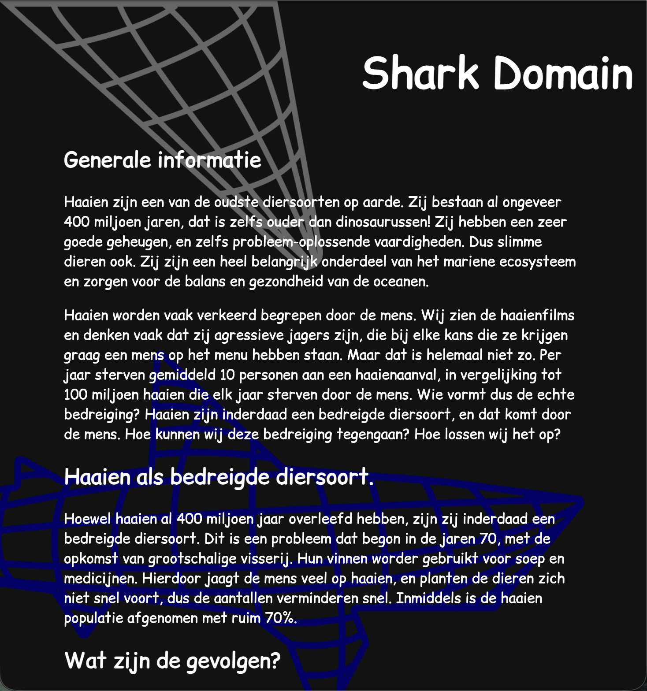
Dit was niet de stijl waar ik voor wilde gaan maar ik zag het meer als een tijdelijke stijl tot dat ik de layout van mijn pagina geregeld had. Ik kreeg te horen dat het wel heel belangrijk is dat ik samen met de stijl en decoratie elementen mijn pagina moet inrichten, wat ik wel begrijp, want aan de hand daarvan wil ik bepaalde teksten positioneren.

Ook op de "Depthometer" pagina heb ik een hele lange image gebruikt als achtergrond als gradient, maar besefte ik later dat ik dit ook gewoon met een CSS gradient kan.

Waarmee ik vaak moeite heb is blijven bij 1 idee. Ik verander steeds van gedachten en heb dan steeds een ander idee voor de stijl van mijn pagina. Maar ik wil wel heel graag door gaan met de stijl die ik op mijn Miro bord staan heb, omdat ik vind dat deze het beste past.
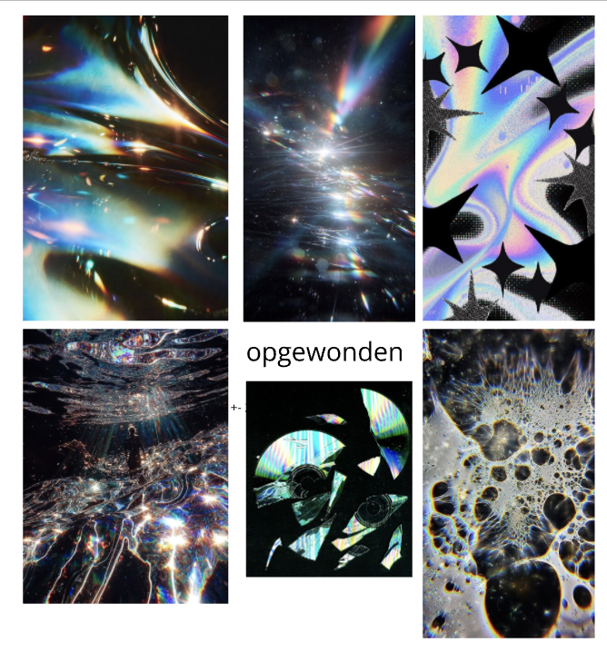
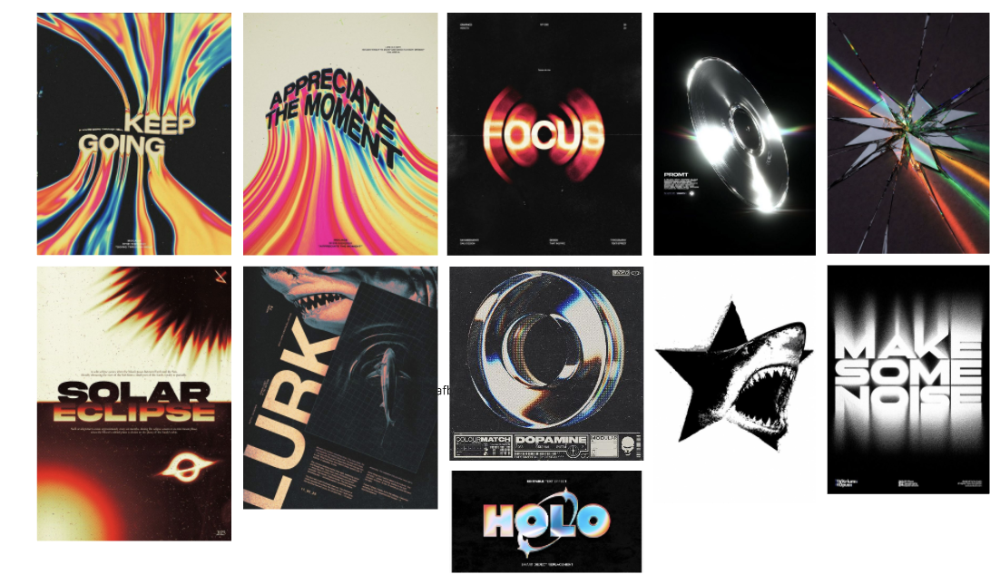

Experimenteren in Adobe Illustrator:
Hier was ik aan het uittesten met chrome effecten in adobe illustrator. Ik dacht misschien kan ik deze gebruiken voor de fotos van haaien op mijn pagina, maar ik denk dat deze toch iets te onduidelijk zijn en kies dan liever voor een soort blue x-ray type effect.
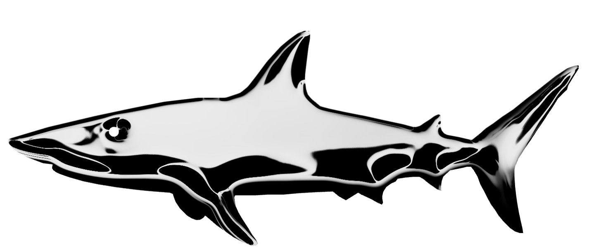

Dit was een beginfase bij het ontwerpen van mijn header. Ik wilde een soort drip effect maar met meer kleuren. Dit was dus de outline om een simpel beeld te krijgen maar ik vond het toch niet heel leuk.
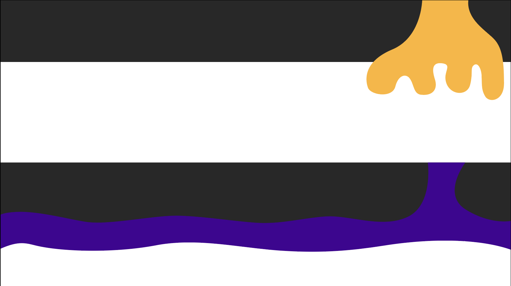
Ik wil dan liever voor de tekst alleen het drip effect gebruiken, maar weet nog niet zeker hoe ik dat zal doen.

Dit was dus het idee voor mijn achtergrond. De twee vinnen zouden dan bij- en uit elkaar schuiven aan de hand van de scherm grootte. Dit heb ik helaas nog niet successvol kunnen doen, en weet ik ook niet of ik die nog wil voor mijn website. Ik houd van de lege ruimte die ik nu op mijn pagina heb, maar wil natuurlijk wel wat dingetjes erbij zetten. Ook houd ik niet heel veel van het saaie zwart wit contrast. dit zou ik eventueel wel kunnen veranderen maar het voelt aan alsof niets past
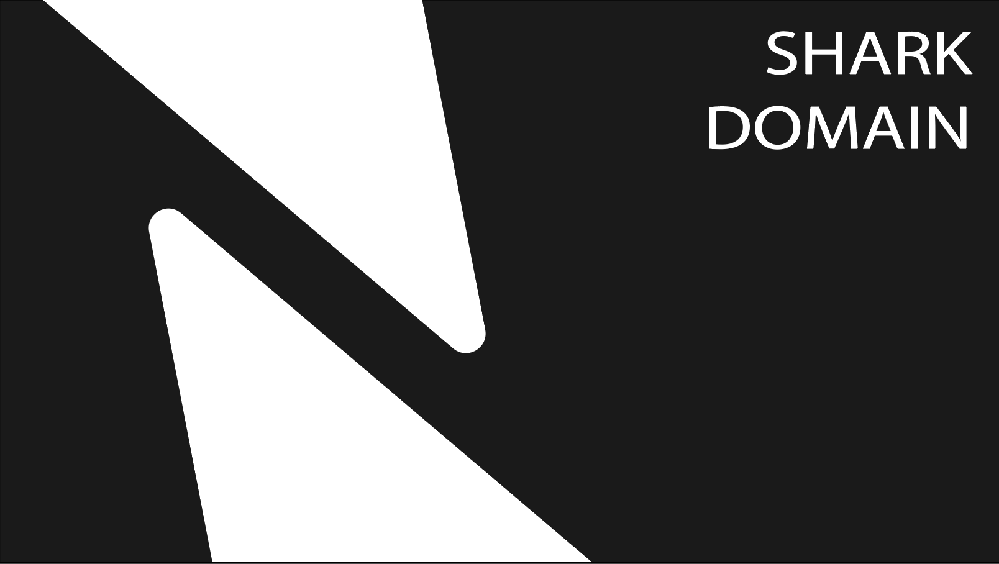

De tweede haai zou dus ook dienen als een tekstvlak. Dit wil ik wel nog ergens toepassen maar nog niet zeker waar en hoe. Ik wil dan wel het kleurrijke chrome effect erop hebben.
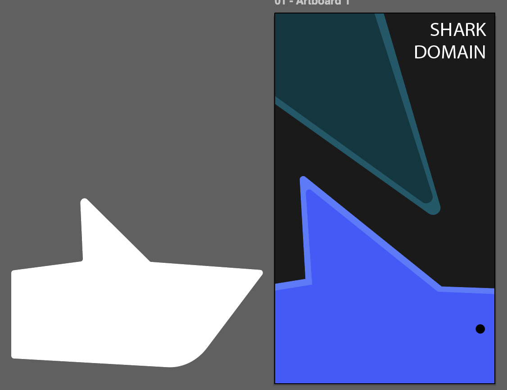

### 21 sept - Compliance Checkout

Wat zijn HTML landmark role elements?
Het zijn elementen die belangrijke en grote gedeeltes van een website aangeven. (main, header, footer, nav) Ze geven dus een duidelijk structuur aan en helpen met screenreaders gebruiken, om snel door een pagina te kunnen navigeren. De screenreader kan de landmarks herkennen om van de ene belangrijke sectie te springen naar een andere.
Maar de header en footer zijn alleen landmarks wanneer ze niet genest staan in een ander landmark, anders is het gewoon een sectie.

Wat zijn heading elementen en hoe horen deze 'genest' te worden?
Heading elementen zijn h1 tot en met h6.
De h1 heeft de belangrijkste en hoogste positie. Denk aan de titel van de pagina.
h2 als subsectie van de h1
h3 een subsectie van de h2 en zo verder tot h6.

Hoe ga jij met cookies om? Beschrijf jouw beweegredenen en of die zijn veranderd na het volgen van dit college.
Ik klik altijd op cookies afwijzen of alleen nodige cookies accepteren die zorgen ervoor dat de website goed werkt, omdat ik niet wil dat alles dat ik online doe wordt getraced alleen zodat ik gepersonaliseerde advertenties krijg. Ik besteed toch nooit aandacht aan de advertenties. Ik weet ook niet heel precies waar zij toegang naar hebben. Ik ben er gewoon geen fan van. Ik ben niet bij de college geweest wegens persoonlijke redenen, maar ik ben niet van gedachten veranderd en klik lekker door op "No thanks" als het mijn toestemming vraagt.

### 18 sept - Voortgangsgesprek

Mijn website is niet heel persoonlijk, wat verbind de haaien aan mij? Waarom heb ik hiervoor gekozen en waarom vind ik dit onderwerp zo bijzonder? Ik heb ook een beetje een saaie website, lijkt op een wikipedia.

Ik moet mijn werk nog uploaden op DLO.

Verder moet ik meer gaan werken aan mijn gekozen stijl, achtergrond en tekst aanpassen aan de hand daarvan. Bronnen en Images toevoegen aan mijn Learning log.

Voeg een light/dark mode button toe.

Handig om te weten wat de step en clamp dingen doen en waarvoor de nummers staan.

Laten zien welke schetsen en inspiratiebeelden ik gebruik heb. Wat mijn ontwerpproces is/was.

CHECKOUT
Waarom geven docenten deze opdracht?
Ik denk dat zij deze opdracht geven om te zien hoe creatief wij kunnen zijn als wij de vrijheid krijgen om iets te maken waar wij enthousiast over zijn en waar wij een deel van onzelf in kunnen herkennen. Tegelijkertijd leren wij ook nieuwe mogelijkheden binnen html en css en wat is een betere manier om iets nieuws te leren dan het direct in de praktijk te gebruiken.

Welke technieken gebruik ik?

Wat zijn de randvoorwaarden?

Waar gebruik ik HTML/CSS voor?

Wat kan er allemaal met CSS?

Lukt het om verschillende ideeën te bedenken?
Het lukt wel, maar ik heb vaak het probleem dat ik denk aan een idee maar makkelijk afdwaal van het eerste idee en in het proces vergeet waar ik allemaal aan dacht. Ik kan dit oplossen door direct mijn ideeën op te schrijven, maar dan heb ik ook niet altijd hetzelfde beeld waaraan ik toen dacht in mijn hoofd.

Lukt het om ideeën te schetsen?
Ja maar ook nee. In mijn hoofd kan iets er heel anders uit zien dan ik kan verbeelden. Ik wil wel beginnen bij 1 punt en dan kijken hoe verder.

Wat doet deze CSS property?

Welke content en welke HTML heb ik nodig?

Hoe kan ik dit soort vormen vormgeven?

Wat als ik hier nu eens 1000 invul?

Retrospect opdrachten
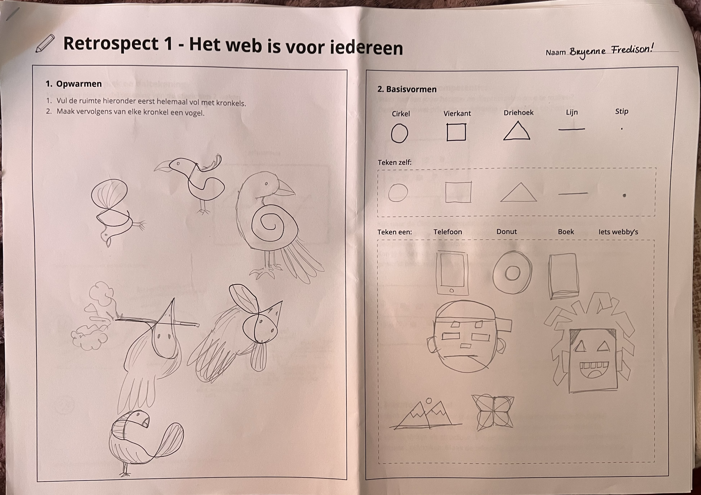
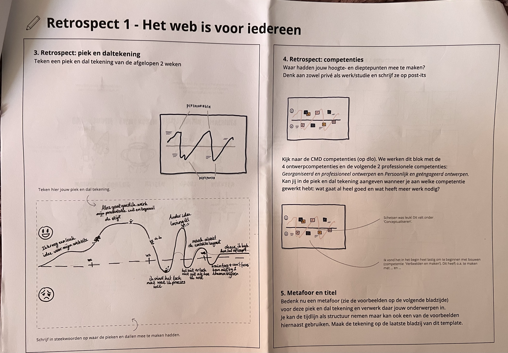
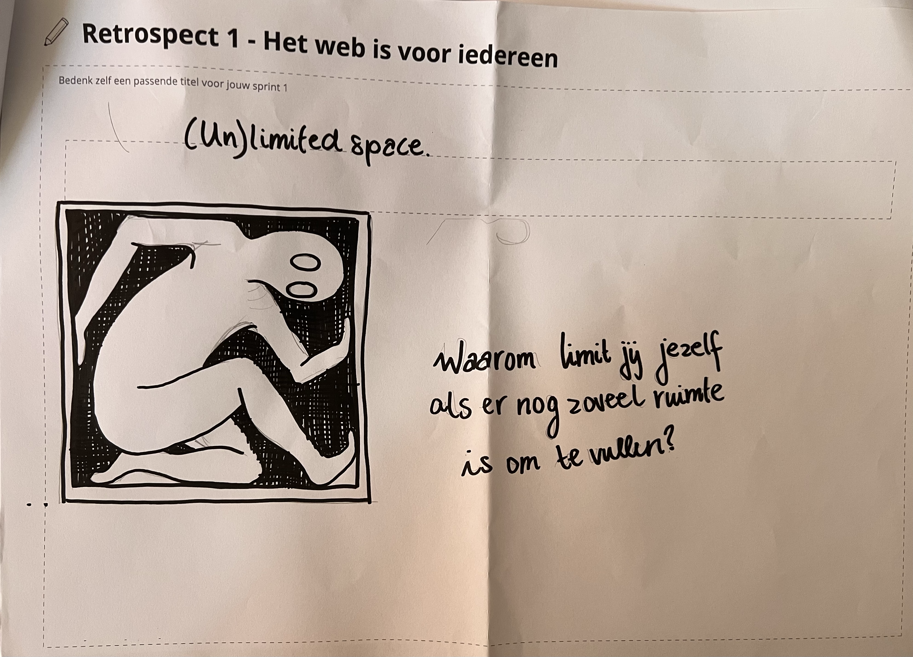

### 17 sept - Thuis werken

Ik heb vandaag heel veel veranderd aan mijn website. Ik ben nog niet klaar met de achtergrond maar wil het sowieso aanpassen en het duidelijker laten aansluiten bij mijn stijl inspiratie. Ik heb nu 2 kolommen naast elkaar staan. Ik heb de lettergroottes responsive gemaakt en eigenlijk de hele pagina ook. Ik heb wel nog images gebruikt van pinterest omdat ik niet genoeg tijd had om deze allemaal zelf te maken. Ik heb veel van de Deep Dives weer nagekeken.

### 15 sept - Deep Dive: Responsive grid + Grid-areas

Ik ben bij de deep dive geweest en heb middels de oefeningen geleerd hoe ik grid-template-columns en rows moet gebruiken, en hoe ik deze in de grid-template-areas goed kan aangeven. Verder ook hoe ik deze responsive kan maken. Ik raakte in het begin vaak in de war met het verschil tussen de columns en rows maar heb de aantakeningen voor mezelf gemaakt dat de columns horizontaal zijn en rows verticaal en werd het daarna eigenlijk veel makkelijker en overzichtelijker om te onthouden. Ik wil dit graag toepassen aan mijn digital garden maaar weet nog niet precies waar.

### 14 sept - Check out

Een website wordt lelijk wanneer:
deze niet responsive is en er niet genoeg witte ruimte is. Alles is dus te dicht op elkaar en niet het is overzichtelijk.
Wannneer het een saaie website is. Er is maar 1 kolom.
Geen goede contrasten gebruikt.
Lettergrootte is overal hetzelfde en de lettertype past niet bij je onderwerp.

Je kunt dus witte ruimte plaatsen tussen teksten, images enz. Meer dan 1 kolom maken. Betere contrasten proberen te gebruiken. Lettergrootte aanpassen aan de hand van kopteksten en paragraphs, en de lettertype baseren op het thema.

Ik doe morgen de Deep Dive dive over responsive grid. Ook wil ik nog de lettergroottes responsive maken met de informatie die staat bij de fonts kleuren en effecten deep dive.

Mijn garen in Webby vocabulair onderbouwen: Ik vind mijn website wel fluïde en adaptief. Het is responsive en nu heb ik wel een heel simpele light en dark versie maar nog geen knopje hiervoor. Ik wil de Deep dive hierover nog nakijken.
Ik heb verschillende states voor mijn links toegevoegd.
Mijn website is tot nu toe wel toegankelijk. zwart op wit contrast.
Mijn website is nog niet volwassen.
Wel expressief omdat ik bezig ben mijn eigen stijl eraan toe te passen.

### 11 sept - Feedback

Ik ben nog niet heel ver gekomen met het bewerken van mijn website omdat ik steeds van gedachten veranderde. Ik had in het begin een heel andere stijl in mijn hoofd dan waar ik nu ben. Ik heb daardoor niet heel veel feedback gehad op de website zelf maar op mijn beeld schetsen kreeg ik gewoon te horen dat die er goed uit zien. Ik heb goed de elementen gehaald uit mijn inspiratie fotos voor de crazy 8.

### 9 sept - Presentatie, Visual Research en Crazy 8

Voor mij is de essentie is het onderwerp duidelijk overbrengen en eigenlijk vertellen waarom ik precies dit onderwerp heb gekozen. Mensen vooral leuke weetjes leren over haaien maar ook laten weten waarom zij zo belangrijk zijn en informeren over de problemen die er zijn voor deze dieren.

??? Welke kwaliteitenlijst

Zij vond mijn onderwerp interessant, informatief en leuk dat ik die gekozen heb. Niets negatiefs te zeggen erover.

Het gevoel is vrolijk voor de leuke weetjes maar ook droevig wanneer je te horen krijgt dat haaien een bedreigde diersoort zijn.

Ik kan de kleuren uit de afbeeldingen halen. Blauw die het meest opvalt. Dat wekt ook voor mij een gevoel op van stilte en kalmheid. Ik heb vooral natuurlijke vormen en een soort cartoon of getekende stijl.

Aan een ander wil ik vertellen dat je helemaal niet bang hoeft te zijn voor (de meeste) haaien, en dat er meer aan ze is dan hun enge tanden. Ik wil voornamelijk korte teksten gebruiken met eigen fotos. Ik wil proberen mijn website zo interactief mogelijk te maken zodat het niet een eentonige tekst en beeld website is, maar ergens waar je de hele dag op zou kunnen blijven.

Ik wil mijn Digital Garden laten gaan over Haaien en waarom zij een bedreigde diersoort zijn, en dit wil ik laten zien door genoeg tekst en eigen beelden aan content te tonen. Ik begin met een stukje eigen content over de geschiedenis van haaien. Hoe lang zij al op de aarde zijn en hoe zij over de jaren heen zijn veranderd. Als het begin is gemaakt kan ik mijn Garden uitbreiden door meer te vertellen over hun huidige situatie en de gevolgen van wat er zal gebeuren als deze dieren uitsterven.

CHECK-OUT
1 Het Visual research helpt je bepalen wat voor stijl jouw website kan hebben, welke kleuren, vormen en typografie je hebben wilt, terwijl je ook de gevoelens van jouw onderwerp uitbeeld. Mijn onderwerp is bijvoorbeeld haaien. Ik begon eerst met een getekende stijl, heel vrolijk en speels, maar kwam na het zoeken van mijn sfeerwoord eigenlijk erachter dat ik een heel andere stijl wilde. Ik kwam met het woord "opgewonden" en denk daarbiij direct aan chrome effects en verschillednde kleuren op een heel donkere achtergrond.

2 Mijn Garden gaat over haaien. Ik ga het doen met beelden van haaien die zelf getekend zullen zijn, tekst over de dieren, heel graag wil ik ook kleine silly animaties, en sound waar ik aan denk wanneer ik denk aan haaien.

3 Ik zou graag verder willen gaan met de chrome en colorful stijl zoals in mijn afbeeldingen op Miro. Ik vind de kleuren heel passend bij mijn onderwerp, en denk echt dat dit past bij mijn onderwerp.

Nadat ik mijn crazy 8 had gedaan met het sfeerwoord "gehypnotiseerd", realiseerde ik dat ik dat eigenlijk helemaal niet voelde. Ik heb dan opnieuw een sfeerwoord gezocht dat beter bij mijn onderwerp paste en toen kwam ik op het woord "opgewonden". Ik vond dat deze voor mij veel beter past bij haaien en heb verder beelden gezocht die passen erbij. Ik verzamelde toen eigenlijk fotos die heel veel verschillden van mijn eerste idee, en vindt deze toch veel beter en passend.

### 7 sept

1 Een digital garden is een persoonlijke website waar iemand zijn ideeën verzamelt en laat groeien. Het hoeft dus niet perfect te zijn en het verandert in de loop van de tijd. Het gaat om leren in het openbaar waarbij je ook de stappen van je denkproces laat zien.

2 Wat maakt een website 'webby'?

Als het fluïde/adaptief is. - Responsiveness, light/dark mode, makkelijk te bedienen enz.

Interactief/dynamisch. - Verschillende states aanwezig (focus, hover, active, enz), herkenbaar zijn.

Toegankelijk. - Goede contrast, visuele hiërarchie, knoppen en buttons goed te zien, alt-teksten op afbeeldingen, pagina is bedienbaar met alleen de keyboard.

Volwassen. - Data wordt over jou opgeslagen en je wordt gewaarschuwd.

Expressief. - CSS Gradients, animaties en transities, layout is interessant en voor de hand liggend, goede lettertype en grootte.

Website is leuk of verassend.

3 Ik wil aan de slag met informatie verzamelen om op mijn website te plaatsen. Korte introductie over haaien, waarom zij een bedreigde diersoort zijn en wat wij hieraan kunnen doen om het t everbeteren. Ook wil ik de nadruk leggen op 1 specifieke haai en iets uitgebreidere informatie daarover verzamelen. Ik wil ook nog nadenken over wat voor layout ik precies wil gebruiken omdat ik nog niet heel zeker ben. Ik had in gedachten een getekende stijl en onder water thema.

### 4 sept - Deep Dive CSS: fonts met kleur en effecten

Ik vond deze deep dive heel leuk en begreep eigenlijk wel helemaal wat ik deed of moest doen. Wij moesten custom fonts toevoegen aan een bestand door gebruik te maken van fotn-face. Ik werd geleerd dat font-weight 400 de normale letterdikte is, 700 wordt gebruikt voor bold en 100 voor italic. Ik kan de font een eigen naam geven en moet deze vervolgens gewoon bij font-family toevoegen bij willekeurige elementen.
Ook heb ik een beetje geleerd over werken met text-shadows, dat ik deze kan opstapelen om een ander effect te maken.

### 4 sept - Deep dive Praktische CSS

Ik heb de Praktische CSS deep dive gedaan. In het begin vond ik alles overzichtelijk, maar toen wij kwamen bij punt 3. Een lelijke pagina consistent en overzichtelijk maken, begreep ik niet meer wat er gebeurde met de calc en var. Ik probeer het uit te puzzelen op html5doctor.com en MDN. Ik begrijp het nu wel maar nog met moeite.

### 2 sept - Deep dive MMD, micro-interacties, forms

We hebben weer de 5 elementen van MMD (Multi Model Design) geleerd namelijk Cue, Feedback, Feedforward, Affordance en Prompt. Het is belangrijk voor de gebruiker om te weten wat je met iets kan. Jij kunt ervor zorgen dat het ontwerp vanzelfsprekend is, en/of dat er genoeg gebruiksaanwijzingen aanwezig zijn. Bevestiging van wat de gebruiker gedaan heeft is ook belangrijk. Dat kan op verschillende manieren bijvoorbeeld een geluidje speelt af, of de states van een knop veranderen, een lichtje gaat aan enz. Maak duidelijk wat er zal gebeuren als de gebruiker op iets klikt. En nadat die erop geklikt heeft zorg ervoor dat aan de gebruiker bekend gemaakt wordt dat het gelukt is of in bewerking is. Een clue geeft je eigenlijk al een beeld van wat er aan de hand is zonder dat jij eerst ergens op hoeft te klikken. Denk maar aan de icoontjes aan de bovenkant van je telefoon. Je ziet de tijd, batterij percentage, internetverbinding enz. Als laatste communiceert een prompt wat de gebruiker moet doen.

### 31 aug - Kickoff

Ik heb vandaag een fork van de model repository gemaakt en gepubliceerd via mijn eigen Github. Daarna heb ik een eigen domeinnaam gekozen en gepubliceerd.

1 Een source hosting platform is een online plek waar jij je websites kunt opslaan en bewerken.
GitHub is een source hosting platform.

2 Ik heb de naam sharkdomain.nl gekozen en heb die gekoppeld via de TransIP DNS. Via de custom Domain op GitHub moest ik ook de naam intoetsen en wachten tot die goedgekeurd werd. Verder heb ik de repository moeten clonen en daarna kon ik aan de slag.

3 De aanpassingen doe ik gewoon via VSCodium. Aan het einde van de dag commit ik deze veranderingen en druk ik op sync changes. Het duurt wel even voordat deze veranderingen online te zien zijn.
